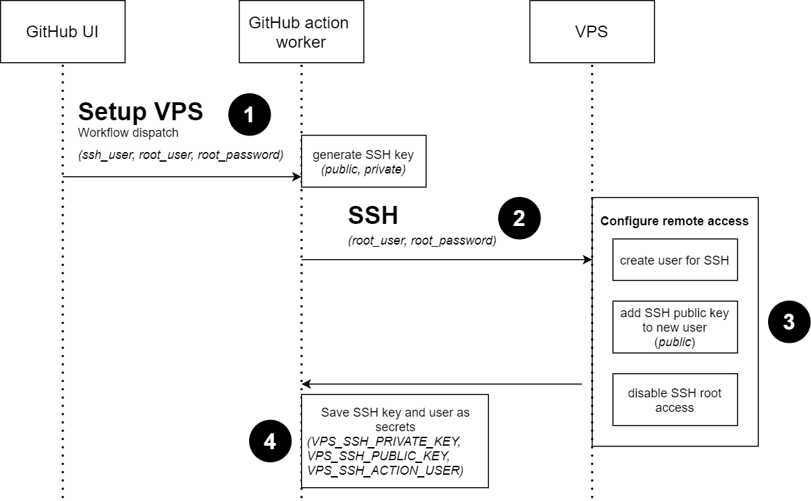

# Setup VPS

> This project contains a set of github actions to configure a VPS from scratch to a Docker Swarm cluster.

## Workflow overview

## Configure remote access

1. When manually launching this action, you will be prompted the following information.
    * **ssh_default_username**: User that will be created to configure SSH key based access (! will be given sudo permission)
    * **ssh_default_password**: Password that will be prompted when prefixing commands with "sudo"
    * **ssh_root_username**: Name of an existing user that will be used for initial configuration (default: root)
    * **ssh_root_username**: Password for this existing user (will be deleted ASAP as OP terminate)
2. Prepare the installation of an SSH key
    * On the action worker, an SSH key pair is generated
3. The action configure an SSH key based access on your VPS
    * The worker access your VPS loging with (username, password)
    * Then it creates {ssh_default_username} user with given password and groups (sudo, docker)
    * And it adds the previously generated SSH public key to this user .ssh/ folder
4. If operation was successfully, the worker adds {ssh_default_username}, {ssh_private_key}, {ssh_public_key} as secrets for your organization
